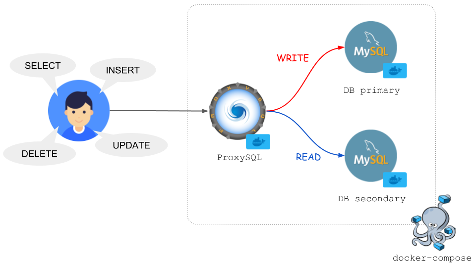

# MySQL Replication and ProxySQL

In this documentation, we will cover
 
 1. Problem Discussion
	 - Common Database problems and solutions.
	 - What is Database Replication?
	 - When do you need this?
 2. MySQL DB Replication (1 master and  2 slaves) on Docker
 3. Load Balancing them using ProxySQL on Docker
 4. Sending Request from our Spring Boot Application.
 5. Observe the Query Execution in the Master and Slave's General log

# Problem Discussion
Let's say, you have a single relational databases instance and you are probably building a web application. So you need a web server and a Web Developement Framework such as Spring Boot, django, nodejs bla bla. Your web application that essentially speaks to HTTP protocol that talks to the browser or some HTTP clients to execute the api endpoints and those apis eventually executing Read/Write operation to the database.

Assume, your database is getting reads/write requests from the client. For example a read request: `SELECT * FROM products WHERE price < 5000`. Your application was working smoothly but as the time passed the you have noticed your query is performing slow, it's not much faster as earlier. It's taking some times which may reduce the user-experience.

But what's the problem here ?
Your *product* tables is growing larger in course of time and when you are executing the query above, it's doing a `Full Table Scan` which basically a Linear Search operation ( Time Complexity `O(n)` ). So you can say, ok fine I'm gonna add an **Index** to `price` column and my beautiful databse will arrange it in a `Balanced Binary Tree` or a `B-Tree` where the Tree *Balances* itself when a new record *Inserted*, *Deleted* or *Updated* the existing column value each time, to make the *Read* operations faster in `O(log n)` Time Complexity where **“n” is the total number of elements in the B-Tree**. But the balancing tree has a cost, besides renge query (`SELECT job FROM products WHERE price BETWEEN 5000 AND 10000`) is not effecient in `B-Tree`, hence `B+ Tree` comes into the picture. But still, what if you have 1 millions records in the `products` table and you just have inserted a new record and bam!! Your DB is doing so much work to `re-balance` the large Tree.

So, What can you do now ? Ok, You can do table **Partitioning** based on `id` let's say, because the `id` use-case fits best here. **Partitioning is a technique to subdivide objects into smaller pieces.** It actually breaks the huge table into many different partiotion tables by range depending on the partiotion key and these partition tables are again mapped by the `<KEY, VALUE>` pair where the *partition_key* as the KEY and *partition_table_reference* as the VALUE of the map.
For example: your page size = 20000 so the ids from 1 to 20000 falls into *partition_1* and ids from 20000 - 40000 goes into *partition_2* and so on and so forth. But don't worry guys, these partitions are *managed implicitly* by the Database itself. It knows, to get result for the for the Specific *Read* query (`SELECT * FROM products WHERE id = 18`) in which partition it needs to look for. So it can be a solution to reduce the Tree Balancing Cost, because as you can feel the Search space is much smaller than before so the `Balanced B+ Tree` cost has optimized. Great, peorblem solved. But as your business grew, your user-base also grown. Now you have a thousands of concurrent users who are reading millions of records from your (Read Heavy) Database and the Single Database server is dealing with a huge number of concurrent TCP connections. Your single Database instance is junked up with these enourmous number of concurrent requestes and it might be ran out of it's `QPS (Query Per Second)` limit too. Here's **Replication** comes into the solution space. 

## What is DB Replication?
DB Replication is a kind of Horizontal Scaling making the same copy of the Full Database and Distribute them in **Master/Slave** architecture where the **Master** deals with all the **Write** operations and *Periodically Updates* it's **Slave** Replicas, who will Handle only the **Read** queries. So your Database load is Distributed now. But remember, the *Slaves* must be **Consistent** with the *Master* so there must be a Replication Strategy.

### How the Replication works from Master to Slaves?
After any Write Query (Insert. Update, Delete) executed in the Master, the DB somehow Replicate the changes to the Slaves. The Master  triggers a change event and the Slaves pull the Changes from the Event and Update themselves. Let's generate some ideas on this.

Idea 1: Can we Stream the SQL Statements?

So Basically, We will be Streaming the SQL Query Statements and the Slaves will pull them from the channel and Execute those SQL Statements inside themselves. Well, this can make the Replication **Inconsistent**. Let's see how.
Assume, you are Creating a new Product
```sql
INSERT INTO products (product_name, product_status, price, created_at)
VALUES('TP-Link Archar C60', 'AVAILABLE', 3500, sysdate(3))
```
- Firstly, The Query will be executed at *Master* when the value of *sysdate(3) = 2022-01-07 12:04:59.114*

- Secondly, The Query will be executed at *Slave 1* when the value of *sysdate(3) = 2022-01-07 12:05:00.100*

- Thirdly, The Query will be executed at *Slave 2* when the value of *sysdate(3) = 2022-01-07 12:05:00.405*

Epic Fail!! Right? This will certainly create inconsitancy problem. So we need to drop this idea.

Idea 2: How about Transfering [Bin Log](https://dev.mysql.com/doc/internals/en/binary-log-overview.html) files?

> The binary log is a set of log files that contain information about data modifications made to a MySQL server instance. Simply it saves the Database States

So, When any Write Query executes in the Master Replica, the change is saved into the Bin Log. After that the Master will transfer these log files towards the Slave Databases **asynchronusly** and the Slaves will pull the change and update their states according to the bin logs.There are also other replication staratagies like Synchronus, Asynchronus and Semi-Asynchronus, but Mysql do Asynchronus replication by default so we are gonna use this for now.

But another problem is knocking at the door. How will you distribute the traffics to the appropriate DB Replicas?
Since, you have a multiple instances of the same database depending on *Read/Write* purpose, how your application can differenfiate when to go to the Read Replica and when to the Master Replica. 
-   DB connection information can change on the way
-   It is troublesome (but complicated) to use DB properly in the Read/Write logic of the application.

So we need a Reverse Proxy for sure to solve this problem. The proxy sits in-between of the Application and Database and Load Balance the Request to the different DB instances based on our operation types (Read/Write). But how the Proxy will distinguish the Request Type ? The answere is the Proxy must be **SQLAware**. We are going to use `ProxySQL` here.

## What is ProxySql?



`ProxySQL` is an *Opensource SQLAware Reverse Proxy* unlike other HTTP or TCP proxy (Nginx, HAProxy etc) it can distinguish the Read/Write operations and deliver the packet to the Specific Replica either it's Master or Slave.
ProxySQL goes between the application and the DB and does the following:
-   Automatic Proxify to the Master/Slave depending on query
-   Load Distribution
-   Change seamless connection settings
By the way, ProxySQL can be used with other DBs like Postgres as well.

## MySQL Replica Configuration
Here is a good read to get the insight of [Mysql Replica Configuration](https://www.digitalocean.com/community/tutorials/how-to-set-up-replication-in-mysql). I used MySQL 5.7 to prepare one master and two slaves, and set up replication settings. Here is the `docker-compose.yml` file I'm using

```yaml
version: '3'
services:
  mysql-master:
    image: mysql:5.7
    container_name: proxysql-mysql-replication-master
    environment:
      MYSQL_ROOT_PASSWORD: password
      MYSQL_DATABASE: sbtest
    volumes:
      - ./master/my.cnf:/etc/mysql/my.cnf
      - ./master/data:/var/lib/mysql
      - ./master/init.sql:/docker-entrypoint-initdb.d/init.sql
    ports:
      - 3306:3306
    networks:
      - mysql_cluster_net 

  mysql-slave1:
    image: mysql:5.7
    container_name: proxysql-mysql-replication-slave1
    environment:
      MYSQL_ROOT_PASSWORD: password
      MYSQL_DATABASE: sbtest
    volumes:
      - ./slave/my-slave1.cnf:/etc/mysql/my.cnf
      - ./slave/data/slave1:/var/lib/mysql
      - ./slave/init.sql:/docker-entrypoint-initdb.d/init.sql
    ports:
      - 3307:3306
    depends_on:
      - mysql-master
    networks:
      - mysql_cluster_net

  mysql-slave2:
    image: mysql:5.7
    container_name: proxysql-mysql-replication-slave2
    environment:
      MYSQL_ROOT_PASSWORD: password
      MYSQL_DATABASE: sbtest
    volumes:
      - ./slave/my-slave2.cnf:/etc/mysql/my.cnf
      - ./slave/data/slave2:/var/lib/mysql
      - ./slave/init.sql:/docker-entrypoint-initdb.d/init.sql
    ports:
      - 3308:3306
    depends_on:
      - mysql-master
    networks:
      - mysql_cluster_net
      
networks:
  mysql_cluster_net:
    driver: bridge

```

Let's bring up the docker containers and check the Master and Slave's status. `docker-compose up -d`

### Check Master's Status
```
docker-compose exec mysql-master sh -c "export MYSQL_PWD=password; mysql -u root sbtest -e 'show master status\G'"
```
Expected Output:
```
*************************** 1. row ***************************
File: mysql-bin.000003
Position: 194
Binlog_Do_DB: sbtest
Binlog_Ignore_DB:
Executed_Gtid_Set: 9618dc00-6f2a-11ec-a895-0242ac120002:1-9
```
### Check Slave 1 Status
```
docker-compose exec mysql-slave1 sh -c "export MYSQL_PWD=password; mysql -u root sbtest -e 'show slave status\G'"
```
Expected Output:
```
*************************** 1. row ***************************
Slave_IO_State: Waiting for master to send event
Master_Host: mysql-master
Master_User: slave_user
Master_Port: 3306
Connect_Retry: 60
Master_Log_File: mysql-bin.000003
Read_Master_Log_Pos: 194
Relay_Log_File: mysql-relay-bin.000004
Relay_Log_Pos: 407
Relay_Master_Log_File: mysql-bin.000003
Slave_IO_Running: Yes
Slave_SQL_Running: Yes
...
Master_Server_Id: 1
Master_UUID: 9618dc00-6f2a-11ec-a895-0242ac120002
Master_Info_File: /var/lib/mysql/master.info
SQL_Delay: 0
SQL_Remaining_Delay: NULL
Slave_SQL_Running_State: Slave has read all relay log; waiting for more updates
Master_Retry_Count: 86400
Master_Bind:
Last_IO_Error_Timestamp:
Last_SQL_Error_Timestamp:
Master_SSL_Crl:
Master_SSL_Crlpath:

Retrieved_Gtid_Set: 9618dc00-6f2a-11ec-a895-0242ac120002:1-9
Executed_Gtid_Set: 9618dc00-6f2a-11ec-a895-0242ac120002:1-9, 962ec4d2-6f2a-11ec-8a4d-0242ac120004:1-5
...
```
As you can se the `Slave_IO_Running: Yes, Slave_SQL_Running: Yes` means the slave is started properly.

Also `Master_UUID: 9618dc00-6f2a-11ec-a895-0242ac120002` means it's connected successfully with the Master. If the Slaves fails to connect to the master then run the ./clean-up.sh. it will gracefully shutdown the containers and clean the master, slave data directories and start the contains in `-d` demon mode

### Check Slave 2 Status
```
docker-compose exec mysql-slave2 sh -c "export MYSQL_PWD=password; mysql -u root sbtest -e 'show slave status\G'"
```
Expected Output:
```
*************************** 1. row ***************************
Slave_IO_State: Waiting for master to send event
Master_Host: mysql-master
Master_User: slave_user
Master_Port: 3306
Connect_Retry: 60
Master_Log_File: mysql-bin.000003
Read_Master_Log_Pos: 194
Relay_Log_File: mysql-relay-bin.000004
Relay_Log_Pos: 407
Relay_Master_Log_File: mysql-bin.000003
Slave_IO_Running: Yes
Slave_SQL_Running: Yes
...
Master_Server_Id: 1
Master_UUID: 9618dc00-6f2a-11ec-a895-0242ac120002
Master_Info_File: /var/lib/mysql/master.info
SQL_Delay: 0
SQL_Remaining_Delay: NULL
Slave_SQL_Running_State: Slave has read all relay log; waiting for more updates
Master_Retry_Count: 86400
Master_Bind:
Last_IO_Error_Timestamp:
Last_SQL_Error_Timestamp:
Master_SSL_Crl:
Master_SSL_Crlpath:
Retrieved_Gtid_Set: 9618dc00-6f2a-11ec-a895-0242ac120002:1-9
Executed_Gtid_Set: 9618dc00-6f2a-11ec-a895-0242ac120002:1-9, 9633aafa-6f2a-11ec-ba14-0242ac120003:1-5
...
```

Looks Good, Now it's time to configure our `ProxySQL`

## ProxySQL Configuration
The configuration file is as follows.
```ruby
datadir="/var/lib/proxysql"

# ProxySQL Admin Configuration 
admin_variables=
{
    admin_credentials="admin:admin;admin2:pass2"
    mysql_ifaces="0.0.0.0:6032"
    refresh_interval=2000
    stats_credentials="stats:admin"
}

# ProxySQL configuration for MySQL Cluster
mysql_variables=
{
    threads=4
    max_connections=2048
    default_query_delay=0
    default_query_timeout=36000000
    have_compress=true
    poll_timeout=2000
    #Where the clinet application will be connected
    interfaces="0.0.0.0:6033;/tmp/proxysql.sock" 
    default_schema="information_schema"
    stacksize=1048576
    server_version="5.7"
    connect_timeout_server=10000
    monitor_history=60000
    monitor_connect_interval=200000
    monitor_ping_interval=200000
    ping_interval_server_msec=10000
    ping_timeout_server=200
    commands_stats=true
    sessions_sort=true
	# setting up mysql cluster monitoring credentials
    monitor_username="monitor"
    monitor_password="monitor"
}

# Host Group 10 = Master Group for Write
# Host Group 20 = Slave Group for Read
mysql_replication_hostgroups =
(
    { writer_hostgroup=10 , reader_hostgroup=20 , comment="host groups" }
)

# replication_lag, checks if the servers are alive or not. 
# replication_lag = 5 mean if any slave replica is unable to catch the the master change event within 5 sec, proxySQL will mark it as SHUNNED (kind of Banned)
mysql_servers =
(
    { address="mysql-master" , port=3306 , hostgroup=10, max_connections=100 , max_replication_lag = 5 },
    { address="mysql-slave1" , port=3306 , hostgroup=20, max_connections=100 , max_replication_lag = 5 },
    { address="mysql-slave2" , port=3306 , hostgroup=20, max_connections=100 , max_replication_lag = 5 }
)

# The SQL Awareness Rules 
mysql_query_rules =
(
    {
        rule_id=100
        active=1
        match_pattern="^SELECT .* FOR UPDATE"
        destination_hostgroup=10
        apply=1
    },
    {
        rule_id=200
        active=1
        match_pattern="^SELECT .*"
        destination_hostgroup=20
        apply=1
    },
    {
        rule_id=300
        active=1
        match_pattern=".*"
        destination_hostgroup=10
        apply=1
    }
)
# ProxySql to Mysql Connection Credential. This credential will be used by our Spring Boot Application or any application you want to develop
mysql_users =
(
    { username = "root" , password = "password" , default_hostgroup = 10 , active = 1 }
)

```
Now Let's add proxySql into our existing docker-compose file

```yaml
...
proxysql:
    image: proxysql/proxysql:2.0.12
    container_name: proxysql-mysql-replication-proxysql
    ports:
      - 6032:6032
      - 6033:6033
    volumes:
      - ./proxysql/proxysql.cnf:/etc/proxysql.cnf
      - ./proxysql/data:/var/lib/proxysql
    networks:
      - mysql_cluster_net
    depends_on:
      - mysql-master
      - mysql-slave1
      - mysql-slave2

networks:
  mysql_cluster_net:
    driver: bridge
```

## Credentials
- ProxySQL [SQL Aware LB]
	-  `:6032` (admin, `user`: admin2, `pass`: pass2)
	-  `:6033` (MySQL endpoint, `user`: root, `pass`: password)
- MySQL replication
	- master x 1
	- slave x 2
	-  `user`: root, `pass`: password

## Getting Started
Turn up all the docker containers `docker-compose up -d` and check docker processes

```
docker ps
```
Output:
```

CONTAINER ID IMAGE COMMAND CREATED STATUS PORTS NAMES

5e5e850339d3 proxysql/proxysql:2.0.12 "proxysql -f -D /var…" 30 seconds ago Up 28 seconds 0.0.0.0:6032-6033->6032-6033/tcp, :::6032-6033->6032-6033/tcp proxysql-mysql-replication-proxysql

b6a5296c7c27 mysql:5.7 "docker-entrypoint.s…" 31 seconds ago Up 30 seconds 33060/tcp, 0.0.0.0:3307->3306/tcp, :::3307->3306/tcp proxysql-mysql-replication-slave1

ef6d0cb4249b mysql:5.7 "docker-entrypoint.s…" 31 seconds ago Up 30 seconds 33060/tcp, 0.0.0.0:3308->3306/tcp, :::3308->3306/tcp proxysql-mysql-replication-slave2

d64d42b53e41 mysql:5.7 "docker-entrypoint.s…" 32 seconds ago Up 31 seconds 0.0.0.0:3306->3306/tcp, :::3306->3306/tcp, 33060/tcp proxysql-mysql-replication-master

```
All containers are up and running.

## Check Replication States now
Incase you don't have mysql client installed in your machine then install it first, the execute the command bellow.
- Mysql Installation (Ubuntu 20.04) (Optional)
```
$ wget https://dev.mysql.com/get/mysql-apt-config_0.8.20-1_all.deb 
$ dpkg -i mysql-apt-config_0.8.20-1_all.deb # and select mysql-8.0 
$ sudo apt install mysql-server-8.0
```
- ProxySQL
```
$ mysql -h 0.0.0.0 -P 6032 -u admin2 -p -e 'select * from mysql_servers'
```
Enter password: pass2
```
+--------------+--------------+------+-----------+--------+--------+-------------+-----------------+---------------------+---------+----------------+---------+
| hostgroup_id | hostname     | port | gtid_port | status | weight | compression | max_connections | max_replication_lag | use_ssl | max_latency_ms | comment |
+--------------+--------------+------+-----------+--------+--------+-------------+-----------------+---------------------+---------+----------------+---------+
| 10           | mysql-master | 3306 | 0         | ONLINE | 1      | 0           | 100             | 5                   | 0       | 0              |         |
| 20           | mysql-slave2 | 3306 | 0         | ONLINE | 1      | 0           | 100             | 5                   | 0       | 0              |         |
| 20           | mysql-slave1 | 3306 | 0         | ONLINE | 1      | 0           | 100             | 5                   | 0       | 0              |         |
+--------------+--------------+------+-----------+--------+--------+-------------+-----------------+---------------------+---------+----------------+---------+
```
Looks Good, All the Master and Slaves are Online and Synced up.

Now Open a new Terminal and Try to run some query and Monitor the General Logs of Master and Slaves

## Showtime
All our tedious configuration is done, now lets open 3 terminals 1 for master and other 2 for slaves and place them side by side so that you can monitor all of them together. Try to run some Read/Write query from your Spring Boot application or any Database Client like Mysql Workbench and Monitor the General Logs of Master and Slaves

1. Read ALL Users
> URL: http://localhost:8080/users
> Method: GET

**Output from SLAVE 1 Console** 
```
docker-compose exec mysql-slave1 sh -c 'tail -f /var/log/mysql/*.log'
```
Output:
```
==> /var/log/mysql/general.log <==
2022-01-07T10:26:42.237593Z      4025 Query     SHOW SLAVE STATUS
2022-01-07T10:26:42.237716Z      4025 Quit

2022-01-07T10:26:43.007045Z 3194 Query select userentity0_.id as id1_0_, userentity0_.name as name2_0_ from users userentity0_

2022-01-07T10:26:43.074505Z      4026 Connect   monitor@proxysql-mysql-replication-proxysql.mysql-replication-poc_my on  using TCP/IP
2022-01-07T10:26:43.074741Z      4026 Query     SELECT @@global.read_only read_only
2022-01-07T10:26:43.075023Z      4026 Query     SET wait_timeout=2000
```

**Execute the Same API again and Check the output in SLAVE 2 Console**
```
docker-compose exec mysql-slave2 sh -c 'tail -f /var/log/mysql/*.log'
```
Output:
```
2022-01-07T10:42:42.119645Z        20 Query     SELECT @@global.read_only read_only
2022-01-07T10:42:42.120000Z        20 Query     SET wait_timeout=2000
2022-01-07T10:42:43.128917Z        20 Query     SELECT @@global.read_only read_only
2022-01-07T10:42:44.143227Z        20 Query     SELECT @@global.read_only read_only
2022-01-07T10:42:44.252141Z        21 Connect   root@proxysql-mysql-replication-proxysql.mysql-replication-poc_my on sbtest using TCP/IP
2022-01-07T10:42:44.252377Z        21 Query     SET character_set_results=NULL

2022-01-07T10:42:44.252534Z        21 Query     select userentity0_.id as id1_0_, userentity0_.name as name2_0_ from users userentity0_

2022-01-07T10:42:45.128786Z        20 Query     SELECT @@global.read_only read_only
2
```

2. CREATE NEW USER
> URL: http://localhost:8080/users
> Method: POST
> body:
```json
{
	"name": "Jhon Doe"
}
```
**Check MASTER Status:**
```
docker-compose exec mysql-master sh -c 'tail -f /var/log/mysql/*.log'
```
**Output from Master Console:**
```
2022-01-07T11:05:11.305574Z       312 Query     SELECT @@global.read_only read_only
2022-01-07T11:05:11.582792Z        35 Query     SET autocommit=0
2022-01-07T11:05:11.583025Z        35 Query     SET character_set_results=NULL
2022-01-07T11:05:11.583181Z        35 Query     insert into users (name) values ('Jhon Doe')
2022-01-07T11:05:11.695636Z        35 Query     commit
2022-01-07T11:05:12.117764Z       312 Query     SHOW SLAVE STATUS
```
**Output from SLAVE 1 Console:**
```
2022-01-07T11:05:11.326982Z       163 Query     SELECT @@global.read_only read_only
2022-01-07T11:05:11.702399Z         2 Query     BEGIN
2022-01-07T11:05:11.702534Z         2 Query     COMMIT /* implicit, from Xid_log_event */
2022-01-07T11:05:12.122072Z       163 Query     SHOW SLAVE STATUS
2022-01-07T11:05:12.122218Z       163 Quit
```
**Output from SLAVE 2 Console:**
```
2022-01-07T11:05:10.331996Z       162 Query     SELECT @@global.read_only read_only
2022-01-07T11:05:11.316285Z       162 Query     SELECT @@global.read_only read_only
2022-01-07T11:05:11.702399Z         2 Query     BEGIN
2022-01-07T11:05:11.702534Z         2 Query     COMMIT /* implicit, from Xid_log_event */
2022-01-07T11:05:12.120590Z       162 Query     SHOW SLAVE STATUS
2022-01-07T11:05:12.120696Z       162 Quit
```
As you can see the **Write** query has executed in **Master** and the **Bin Log** has been *Replicated from the Master to the Slave Replicas*

## Try it yourself
1. [Download](./user_api_postman_collection.json) the Postman Collection
2. Run the Spring Boot Application
3. Try Executing the API endpoints

## Refernces
- B-Tree
	- https://www.geeksforgeeks.org/introduction-of-b-tree-2/
- B+ Tree 
	- https://www.geeksforgeeks.org/introduction-of-b-tree/
- B Tree vs B+ Tree
	- https://stackoverflow.com/questions/870218/what-are-the-differences-between-b-trees-and-b-trees
	- http://www.differencebetween.info/difference-between-b-tree-and-b-plus-tree 
- Database Partitioning
	- https://docs.oracle.com/en/database/oracle/oracle-database/19/vldbg/partition-concepts.html#GUID-EA7EF5CB-DD49-43AF-889A-F83AAC0D7D51
- Disadvantages of Horizontal Partitioning
	- https://www.relationaldbdesign.com/database-analysis/module6/disadvantages-ofHorizontal-partitioning.php
- MySQL Bin Log
	- https://dev.mysql.com/doc/internals/en/binary-log-overview.html
- MySQL Replication Stratagy
	- https://severalnines.com/resources/database-management-tutorials/mysql-replication-high-availability-tutorial
- ProxySQL Configuration
	- https://proxysql.com/documentation/global-variables/mysql-variables/
	- Replication Lag
		- https://proxysql.com/documentation/backend-monitoring/
		- https://proxysql.com/documentation/backend-server-configuration/
	- ProxySQL Rules
		- https://proxysql.com/documentation/proxysql-configuration/
